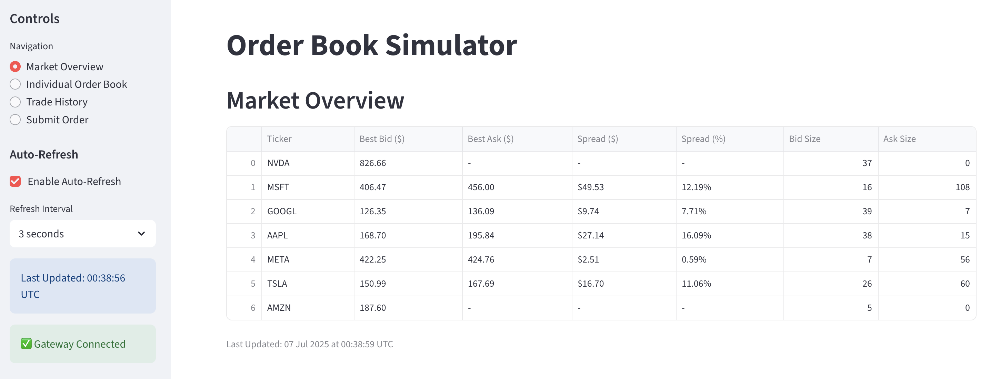
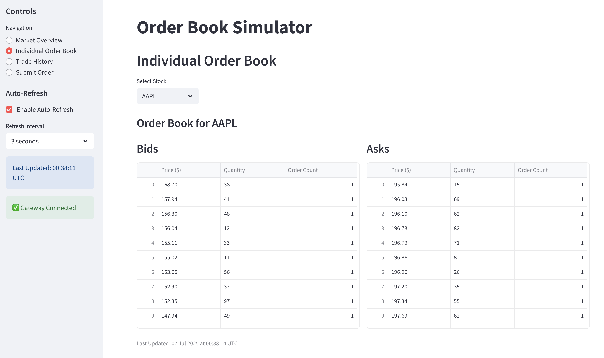
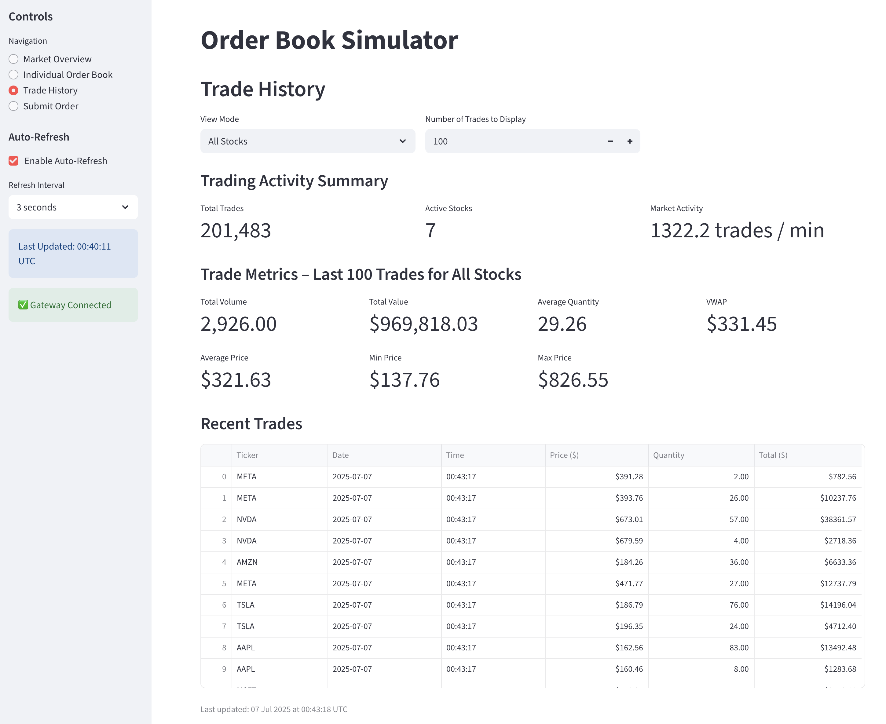
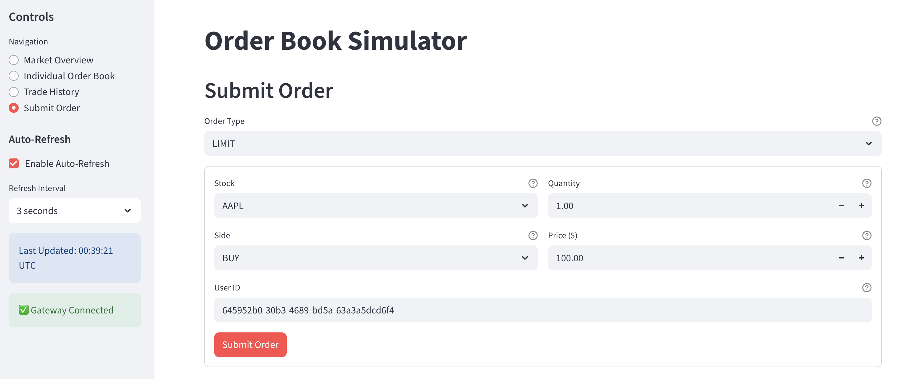
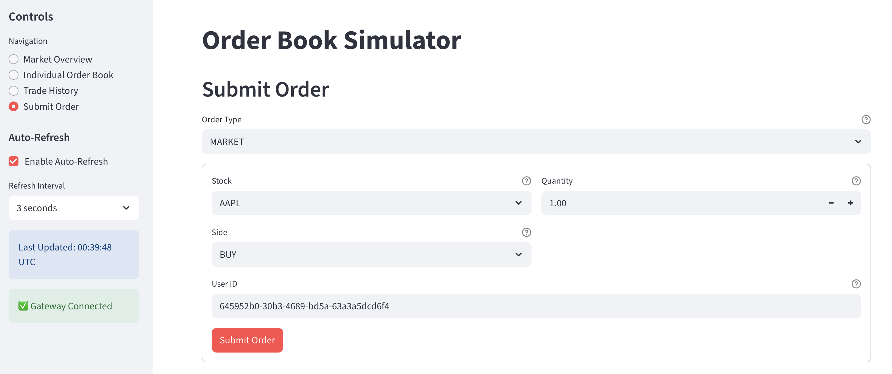

# Order Book Simulator

[](https://github.com/astral-sh/ruff)
[](https://github.com/IsaacCheng9/order-book-simulator/actions/workflows/test.yml)

An equity order matching engine simulating US stock exchange mechanics with an
interactive dashboard, built in Python. Features price-time priority matching,
automated trade execution, real-time market data processing, advanced analytics,
and full REST API access via FastAPI.

## Screenshots






<!-- markdownlint-disable-next-line MD033 -->
<details>
<!-- markdownlint-disable-next-line MD033 -->
<summary>Trade History (Single Stock)</summary>


</details>

<!-- markdownlint-disable-next-line MD033 -->
<details>
<!-- markdownlint-disable-next-line MD033 -->
<summary>Submit Market Order</summary>



</details>

## Key Features

- **Order matching engine** – price-time priority matching for limit and market
  orders
- **Real-time market data** – live order book updates, trade analytics, and
  market statistics
- **Advanced analytics** – VWAP calculations, trade metrics, market activity
  tracking, and historical data analysis
- **Interactive web-based Streamlit dashboard** – market monitoring, analysis,
  and order submission
- **REST API via FastAPI** – full programmatic access with comprehensive
  documentation
- **Market simulation tool** – automated order generation for demonstration
  purposes
- **Highly performant, scalable architecture** – Redis caching and Kafka
  messaging for real-time processing
- **Containerised deployment** – easy deployment and local development via
  Docker Compose

## Components

### Order Book Services

The order book services handle order processing, matching, and market data
dissemination. We expose the services via a FastAPI gateway service which
enables the user to interact with the services via REST API calls.

The system consists of four main services:

- **Gateway Service**: REST API service that handles incoming orders and market
  data requests
- **Matching Engine**: Processes orders and executes trades using price-time
  priority
- **Market Data Service**: Manages market data dissemination and analytics
- **Database**: Stores order and trade history
- **Streamlit UI**: Interactive web dashboard providing real-time market data
  visualisation, order book analysis, trade history, and order submission

### Market Simulator

The market simulator is a tool that allows you to simulate market activity to
demonstrate how the order book services work. We use the simulator to generate
orders for the order book services to process.

You can find the `MarketSimulator` class in
[src/order_book_simulator/simulator/market_simulator.py](./src/order_book_simulator/simulator/market_simulator.py).
We've also provided an example script in
[examples/market_simulator_usage.py](./examples/market_simulator_usage.py) that
shows how to use the `MarketSimulator` class to simulate market activity.

## Technology Stack

- **FastAPI**: REST API framework for the gateway service
- **Polars**: Data processing and analysis
- **SQLAlchemy**: ORM for the database
- **Pydantic**: Data modelling and validation
- **Kafka**: Message broker for order flow and market data
- **PostgreSQL**: Persistent storage for orders and trades
- **Redis**: Caching for real-time market data
- **Streamlit**: UI for the interactive web dashboard
- **Docker**: Containerisation and deployment

## Usage

### Installing Dependencies

Run the following command from the [project root](./) directory:

```bash
uv sync --all-extras --dev
```

### Running the Order Book Services

Use Docker Compose to build and run the services locally:

```bash
docker compose up --build
```

From there, you can interact with the services:

- **Streamlit UI**: [http://localhost:8501](http://localhost:8501) – Interactive
  dashboard for market monitoring, analysis, and user-friendly order submission
- **FastAPI Documentation**:
  [http://localhost:8000/docs](http://localhost:8000/docs) – REST API interface
  for programmatic, full-featured access to the order book services

### Resetting the Order Book Services

To reset the order book services, you can stop the services and remove the
containers, images, and volumes:

```bash
docker compose down -v
```

### Running the Market Simulator Example

To run the market simulator, you can use the following command:

```bash
uv run python examples/market_simulator_usage.py
```
