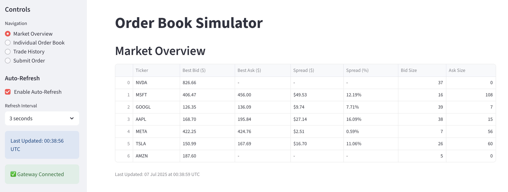
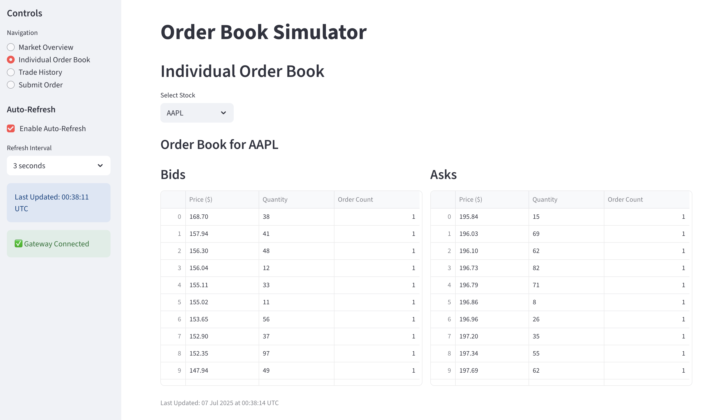
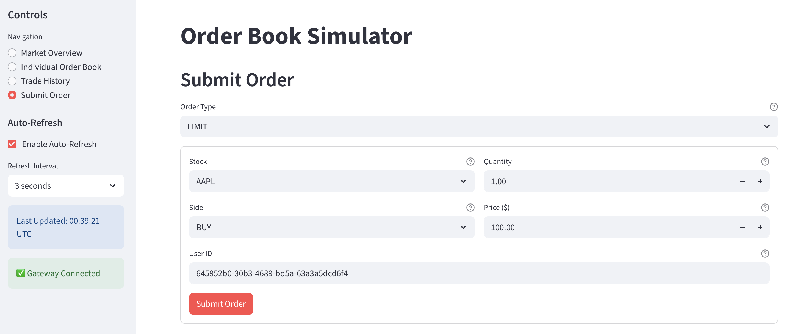
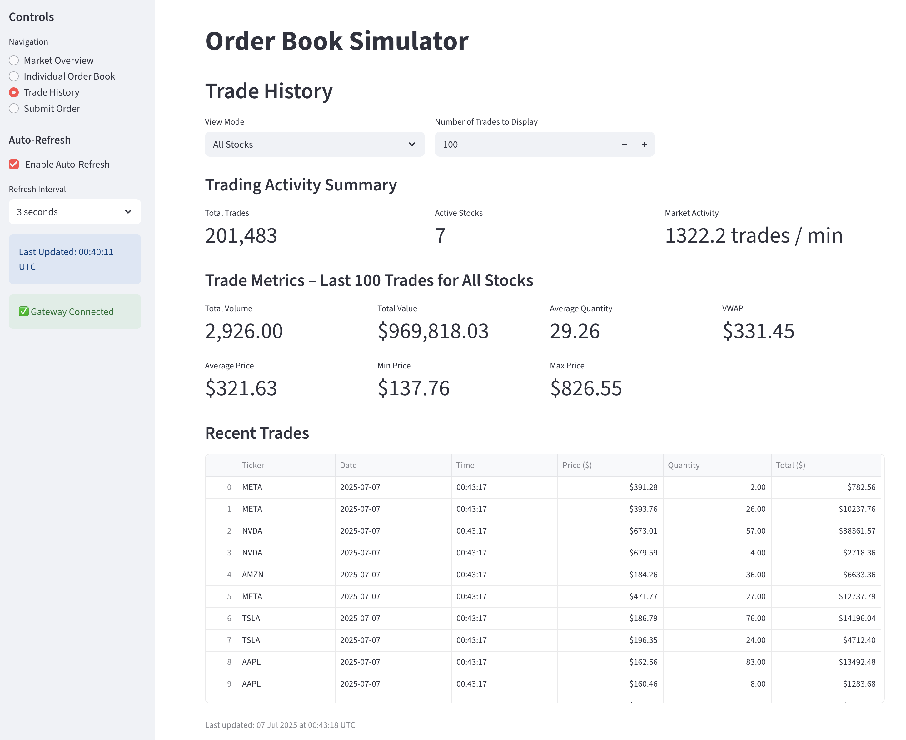
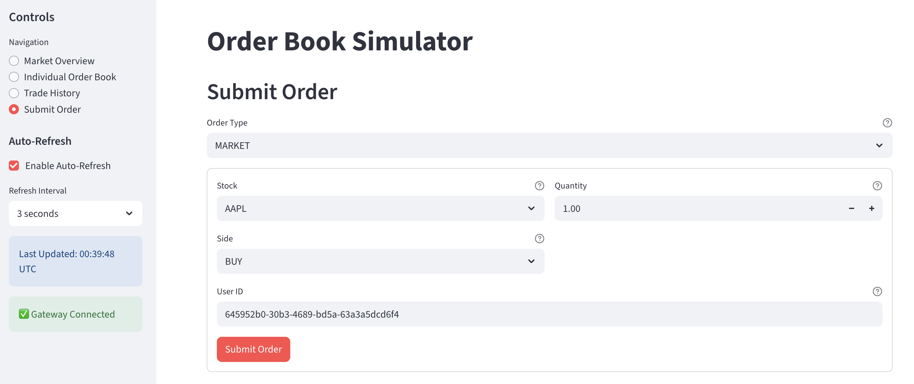

# Order Book Simulator

[](https://github.com/astral-sh/ruff)
[](https://github.com/IsaacCheng9/order-book-simulator/actions/workflows/test.yml)

An equity order matching engine simulating US stock exchange mechanics with an
interactive dashboard, built in Python. Features price-time priority matching,
automated trade execution, real-time market data processing, advanced analytics,
and full REST API access via FastAPI.

## Screenshots






<!-- markdownlint-disable-next-line MD033 -->
<details>
<!-- markdownlint-disable-next-line MD033 -->
<summary>Trade History (Single Stock)</summary>



</details>

<!-- markdownlint-disable-next-line MD033 -->
<details>
<!-- markdownlint-disable-next-line MD033 -->
<summary>Submit Market Order</summary>



</details>

## Key Features

- **Order matching engine** – price-time priority matching for limit and market
  orders
- **Real-time market data via WebSocket streaming** – server-push delta fan-out
  at 2.7M msg/s with per-client backpressure, sequence-based reconnect recovery,
  and 86% bandwidth reduction over snapshot polling
- **UDP multicast market data feed** – O(1) fan-out with binary wire format,
  sequence gap detection, and deterministic recovery via HTTP delta catchup or
  full snapshot fallback, mirroring the architecture used by real exchanges
  (e.g. CME MDP, Nasdaq ITCH) to ensure fair, simultaneous delivery to all
  participants
- **Delta publishing** – sequence-based incremental order book updates with
  bounded buffer and snapshot fallback
- **Advanced analytics** – VWAP calculations, trade metrics, market activity
  tracking, and historical data analysis
- **Interactive web-based Streamlit dashboard** – market monitoring, analysis,
  and order submission
- **REST API via FastAPI** – full programmatic access with comprehensive
  documentation
- **Market simulation tool** – automated order generation for demonstration
  purposes
- **Highly performant, scalable architecture** – Redis caching and Kafka
  messaging for real-time processing
- **Containerised deployment** – easy deployment and local development via
  Docker Compose

## Components

### Order Book Services

The order book services handle order processing, matching, and market data
dissemination. We expose the services via a FastAPI gateway service which
enables the user to interact with the services via REST API calls.

The system consists of four main services:

- **Gateway Service**: REST API and WebSocket service that handles incoming
  orders, market data requests, and real-time streaming
- **Matching Engine**: Processes orders and executes trades using price-time
  priority
- **Market Data Service**: Manages market data dissemination and analytics
- **Database**: Stores order and trade history
- **Streamlit UI**: Interactive web dashboard providing real-time market data
  visualisation, order book analysis, trade history, and order submission

### Market Simulator

The market simulator is a tool that allows you to simulate market activity to
demonstrate how the order book services work. We use the simulator to generate
orders for the order book services to process.

You can find the `MarketSimulator` class in
[src/order_book_simulator/simulator/market_simulator.py](./src/order_book_simulator/simulator/market_simulator.py).
We've also provided an example script in
[examples/market_simulator_usage.py](./examples/market_simulator_usage.py) that
shows how to use the `MarketSimulator` class to simulate market activity.

## Technology Stack

- **FastAPI**: REST API and WebSocket framework for the gateway service
- **Polars**: Data processing and analysis
- **SQLAlchemy**: ORM for the database
- **Pydantic**: Data modelling and validation
- **Kafka**: Message broker for order flow and market data
- **PostgreSQL**: Persistent storage for orders and trades
- **Redis**: Caching for real-time market data and Pub/Sub for WebSocket delta
  fan-out
- **Streamlit**: UI for the interactive web dashboard
- **Docker**: Containerisation and deployment

## Usage

### Installing Dependencies

Run the following command from the [project root](./) directory:

```bash
uv sync --all-extras --dev
```

### Running the Order Book Services

Use Docker Compose to build and run the services locally:

```bash
docker compose up --build
```

From there, you can interact with the services:

- **Streamlit UI**: [http://localhost:8501](http://localhost:8501) – Interactive
  dashboard for market monitoring, analysis, and user-friendly order submission
- **FastAPI Documentation**:
  [http://localhost:8000/docs](http://localhost:8000/docs) – REST API interface
  for programmatic, full-featured access to the order book services

### Resetting the Order Book Services

To reset the order book services, you can stop the services and remove the
containers, images, and volumes:

```bash
docker compose down -v
```

### Running the Market Simulator Example

To run the market simulator, you can use the following command:

```bash
uv run python examples/market_simulator_usage.py
```

### Running Benchmarks

The project includes two categories of benchmarks:

#### Unit Benchmarks (No Docker Required)

```bash
# Benchmark the core order book data structure (pure Python, synchronous).
uv run python benchmarks/unit/order_book_benchmark.py

# Benchmark the full matching engine with mocked I/O.
uv run python benchmarks/unit/matching_engine_benchmark.py

# Benchmark delta payload sizes vs full snapshots.
uv run python benchmarks/unit/delta_payload_benchmark.py

# Benchmark WebSocket fan-out throughput and push latency.
uv run python benchmarks/unit/websocket_benchmark.py

# Benchmark UDP multicast vs WebSocket fan-out scaling.
uv run python benchmarks/unit/multicast_benchmark.py

# Run all unit benchmarks together.
uv run python benchmarks/unit/run_all_benchmarks.py
```

The order book benchmark measures the raw performance of the matching logic and
data structures (higher throughput). The matching engine benchmark measures
end-to-end throughput with mocked dependencies (lower throughput), showing async
orchestration overhead.

##### WebSocket Benchmark Results

Fan-out throughput and push latency from order book operation to broadcast
completion, measured with mock WebSocket connections:

| Subscribers | Fan-Out (msg/s) | Push Latency p50 (μs) | Push Latency p99 (μs) |
| ----------: | --------------: | --------------------: | --------------------: |
|           1 |       2,103,421 |                  10.1 |                  31.5 |
|          10 |       2,689,678 |                  13.2 |                  26.5 |
|          50 |       2,775,645 |                  27.9 |                  52.3 |
|         100 |       2,753,206 |                  45.9 |                  61.6 |
|         500 |       2,694,437 |                 191.3 |                 246.1 |
|       1,000 |       2,714,265 |                 374.0 |                 516.0 |

Throughput stays flat at ~2.7M msg/s thanks to non-blocking `put_nowait` on
per-client bounded queues. Slow consumers get messages dropped instead of
blocking broadcast to other clients.

Push latency vs polling comparison (single subscriber):

| Polling Interval | Avg Polling Latency | WebSocket Speedup |
| ---------------: | ------------------: | ----------------: |
|              1ms |               0.5ms |               51x |
|             10ms |               5.0ms |              513x |
|             50ms |              25.0ms |            2,564x |
|            100ms |              50.0ms |            5,128x |
|            500ms |             250.0ms |           25,641x |
|          1,000ms |             500.0ms |           51,282x |

Delta streaming achieves an **86.1% bandwidth reduction** over snapshot polling
(269 bytes vs 1,938 bytes average per update).

##### UDP Multicast vs WebSocket Benchmark Results

Publisher-side cost per broadcast comparing UDP multicast (single `sendto`) vs
WebSocket (N `put_nowait` enqueues):

| Subscribers | UDP Multicast (μs/msg) | WebSocket (μs/msg) | Ratio |
| ----------: | ---------------------: | -----------------: | ----: |
|           1 |                   12.6 |                0.5 | 0.04x |
|          10 |                   15.5 |                3.7 | 0.24x |
|          50 |                   13.7 |               18.1 | 1.32x |
|         100 |                   14.1 |               35.9 | 2.55x |
|         500 |                   15.6 |              192.1 | 12.3x |
|       1,000 |                    9.0 |              400.8 | 44.6x |

UDP multicast publisher cost stays flat at ~14 μs regardless of subscriber
count, while WebSocket scales linearly. At 1,000 subscribers, UDP multicast is
**~45x cheaper** per broadcast. End-to-end publish latency (order book operation
to deliver) shows the same O(1) vs O(N) pattern, with UDP multicast holding
steady at ~22 μs p50 while WebSocket reaches 382 μs at 1,000 subscribers.

#### Integration Benchmarks (Requires Docker Compose)

```bash
# Integration benchmark with real Redis and Kafka.
docker compose up -d redis kafka
sleep 5
python benchmarks/integration/integration_benchmark.py
docker compose down -v
```

The integration benchmark uses real Redis and Kafka, reflecting true production
performance (lowest throughput). This shows the impact of actual I/O operations
and is the most realistic measure of production performance.
